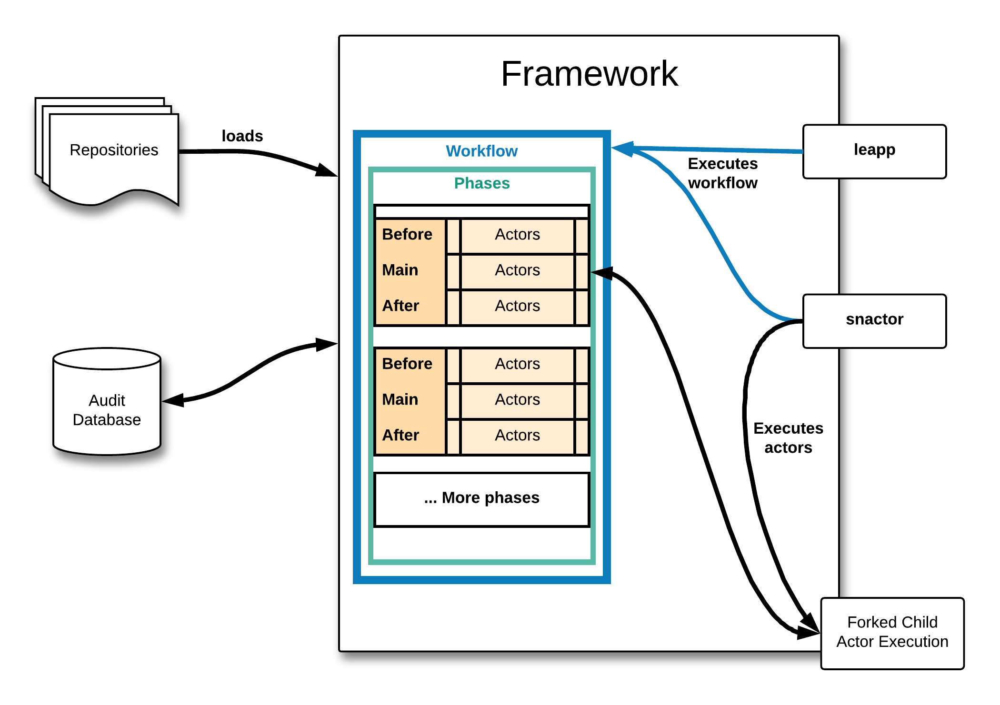

# Architecture overview

There are two tools for working with the framework, the end user application `leapp` and the development utility `snactor`. The `leapp` tool is designed to run specific workflows, while `snactor` can run arbitrary workflows but also individual [actors](/actors).

A *workflow* describes what work is going to get done and when. Each workflow is made of a sequence of *phases* which contain *actors* split into 3 stages - before, main and after. Workflows, actors and all the parts necessary for the execution are loaded from repositories.

Each actor is executed in a forked child process to prevent modification of application state. All messages and logs produced by the actors are stored in the *audit database*.

For more information about each part of the architecture, check [terminology](http://leapp.readthedocs.io/en/latest/terminology.html).

### How is this different from ansible?

Leapp is event-driven. Execution of actors is dependent on data produced by other actors running before them. This data is passed around in form of *messages*.
This is in stark contrast with Ansible where everything has to be specified up front.

